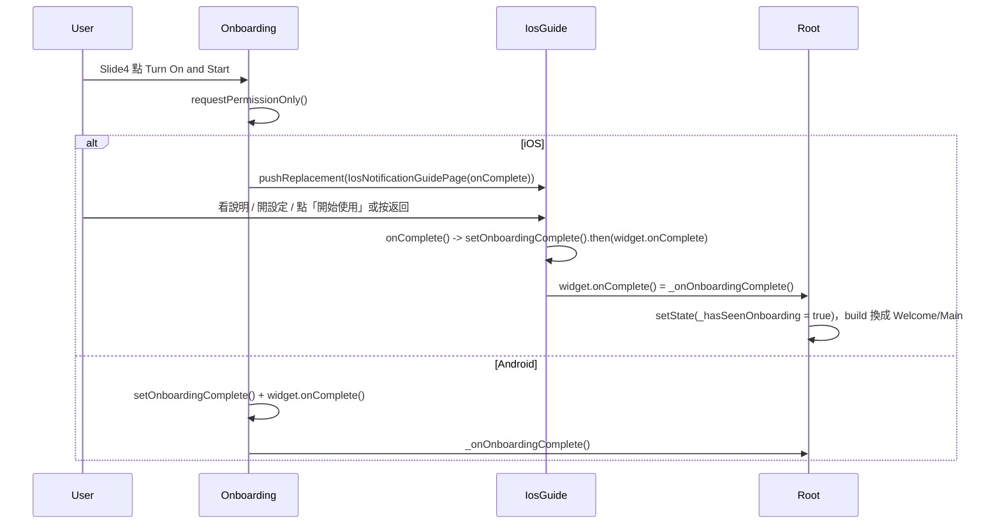

# iOS 通知設定頁整合 — 邏輯與流程檢查

## 1. 檔案與引用

| 檔案 | 用途 |
|------|------|
| [lib/pages/ios_notification_guide_page.dart](lib/pages/ios_notification_guide_page.dart) | 單頁 iOS 通知設定指引（橫幅／顯示預覽 + 快速開啟設定），含 `onComplete`、`PopScope` |
| [lib/pages/welcome/onboarding_screen.dart](lib/pages/welcome/onboarding_screen.dart) | Slide3 直接進 Slide4；Slide4「Turn On & Start」依平台分支（iOS → 推指引頁，Android → 完成 onboarding） |
| [lib/pages/me_page.dart](lib/pages/me_page.dart) | Notifications 直接進 PushCenter；僅 iOS 顯示「iOS 通知設定建議」ListTile |
| [lib/pages/welcome/onboarding_store.dart](lib/pages/welcome/onboarding_store.dart) | 仍使用 `setOnboardingComplete()`、`hasSeenOnboarding()`，未刪除 |

- **已刪除**：`notification_tutorial_page.dart`、`notification_tutorial_store.dart`；無殘留引用。
- **平台判斷**：onboarding 用 `dart:io` 的 `Platform.isIOS`；Me 用 `Theme.of(context).platform == TargetPlatform.iOS`（無需 dart:io）。

---

## 2. Onboarding 流程（Slide3 → Slide4 → 完成）

1. **Slide3 點 Next**：`onNext` 為 `_nextPage`，直接呼叫 `_pageController.nextPage(...)`，PageView 從 index 2 到 3（Slide4）。無教學頁插入。
2. **Slide4「Turn On & Start」**：呼叫 `_enableNotifications()`。
3. **`_enableNotifications()`**：
   - `await NotificationService().requestPermissionOnly()`。
   - `if (!mounted) return`。
   - **若 `Platform.isIOS`**：`Navigator.pushReplacement(context, IosNotificationGuidePage(onComplete: () { setOnboardingComplete().then((_) => widget.onComplete()); }))`。堆疊變為 `[IosNotificationGuidePage]`；OnboardingScreen 被替換並 dispose。
   - **否則（Android）**：`await setOnboardingComplete()`，`if (mounted) widget.onComplete()`。
4. **onComplete 順序**：先 `setOnboardingComplete().then((_) => widget.onComplete())`，確保 SharedPreferences 寫入完成後再呼叫根層 `_onOnboardingComplete()`，下次啟動時 `hasSeenOnboarding()` 為 true。
5. **根層**：`widget.onComplete()` 即 main 的 `_onOnboardingComplete()`，會 `setState(() { _hasSeenOnboarding = true; _showWelcomePage = true; })`，build 改為回傳 BubbleBootstrapper（Welcome/Main），整棵 MaterialApp 換掉，IosNotificationGuidePage 被 dispose。**不需**再 `Navigator.pop`。

**結論**：Onboarding 與根層 rebuild 一致；onComplete 在 prefs 寫入後才觸發，避免改亂。

---

## 3. IosNotificationGuidePage 行為

- **`onComplete != null`（從 onboarding 進入）**：
  - **PopScope**：`canPop: false`，返回鍵／滑動返回不會真的 pop；`onPopInvokedWithResult(didPop: false, ...)` 時呼叫 `onComplete!()`，根層 rebuild，頁面被換掉。
  - **「開始使用」按鈕**：`onPressed: onComplete`，同樣觸發根層完成。
  - 兩種離開方式都會執行 `setOnboardingComplete().then((_) => widget.onComplete())`，邏輯一致。
- **`onComplete == null`（從 Me 進入）**：
  - **PopScope**：`canPop: true`，返回鍵正常 pop 回 Me。
  - 不顯示「開始使用」按鈕，僅靠 AppBar 返回。
- **`_openAppSettings`**：`launchUrl(Uri.parse('app-settings:'))`，iOS 會開啟 App 設定；Android 上可能無效，按鈕仍顯示（頁面標題為「iOS 通知設定」）。
- **API**：`withValues(alpha: ...)` 已取代 `withOpacity`，無 deprecated 警告。

---

## 4. Me 頁流程

- **Notifications**：`onTap` 直接 `Navigator.push(context, PushCenterPage())`，無 async、無教學完成檢查。
- **「iOS 通知設定建議」**：僅在 `Theme.of(context).platform == TargetPlatform.iOS` 時顯示；`onTap` 推 `IosNotificationGuidePage()`（不傳 `onComplete`），返回靠 AppBar/返回鍵。
- ListTile 順序：Notifications →（僅 iOS）iOS 通知設定建議 → Divider → Theme → …，未打亂其他項目。

---

## 5. 邊界與閉包

- **pushReplacement 後的 widget 引用**：onComplete 閉包內 `widget` 為當時的 OnboardingScreen；`widget.onComplete` 為 main 傳入的 `_onOnboardingComplete`。執行 onComplete 時 OnboardingScreen 已不在樹上，但 `_onOnboardingComplete` 仍綁定 _AppRootState，根層仍在樹上，呼叫 `widget.onComplete()` 會正確觸發 setState，無誤。
- **mounted**：`_enableNotifications` 在 async 後有 `if (!mounted) return`；Android 分支有 `if (mounted) widget.onComplete()`，避免 dispose 後操作。
- **Android Slide4**：不推 IosNotificationGuidePage，直接 `setOnboardingComplete()` + `widget.onComplete()`，與原本行為一致。

---

## 6. 流程總覽

---

## 7. 檢查結果摘要

| 項目 | 狀態 |
|------|------|
| Slide3 直接進 Slide4 | 已改為 _nextPage，無教學頁 |
| Slide4 iOS 推指引頁 | Platform.isIOS → pushReplacement(IosNotificationGuidePage(onComplete)) |
| Slide4 Android 完成 onboarding | else 分支 setOnboardingComplete + widget.onComplete |
| onComplete 順序 | setOnboardingComplete().then((_) => widget.onComplete())，prefs 先寫再過場 |
| PopScope 與返回鍵 | onComplete != null 時 canPop: false，返回觸發 onComplete |
| 根層 rebuild | 不 pop，僅靠 onComplete 觸發 setState 換樹 |
| Me Notifications | 直接 PushCenterPage |
| Me iOS 指引列 | 僅 iOS 顯示，推 IosNotificationGuidePage() 無 onComplete |
| 舊教學 / store 引用 | 已刪除，無殘留 |
| onboarding_store | 保留，main 與 onboarding 仍使用 |

整體邏輯與流程一致，無遺漏或矛盾；onComplete 已改為在 setOnboardingComplete 完成後再呼叫 widget.onComplete()，避免改亂。
